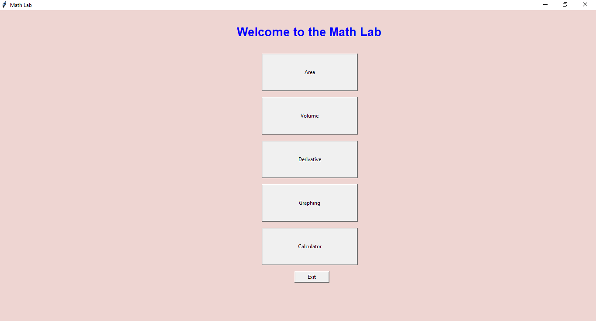
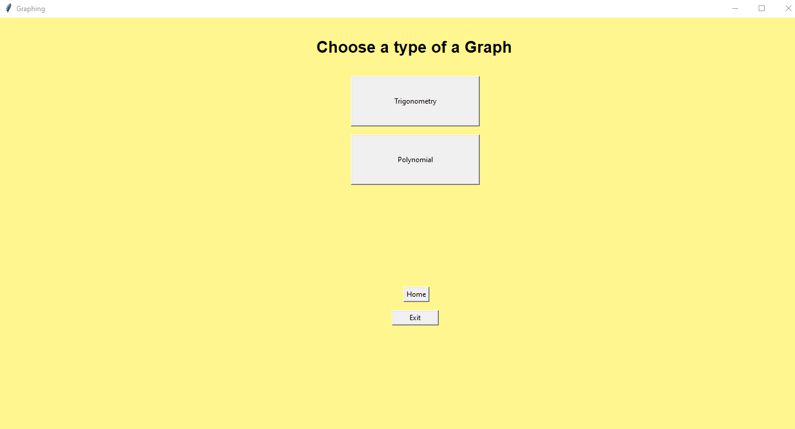
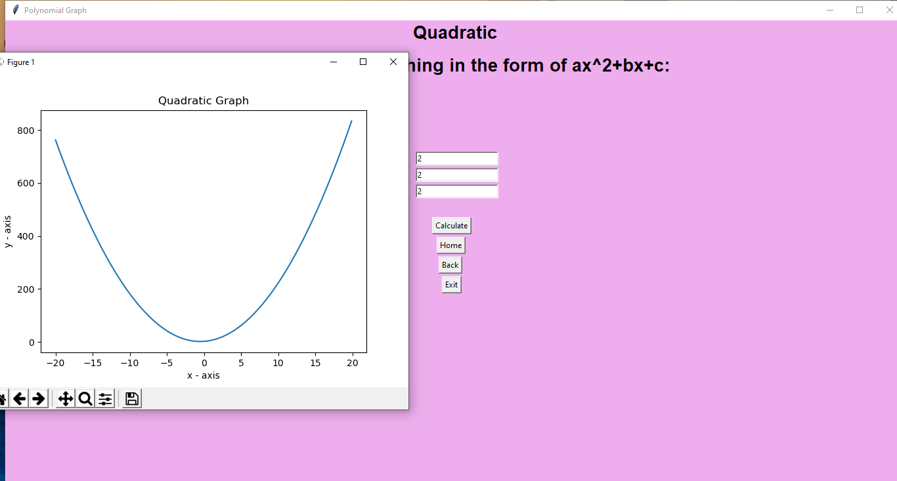

## COMP1001-Calculator
Before starting, please install
Numpy and matplotlib librariers

You can do that using PIP:

```
pip install numpy
pip install matplotlib
```
## To start working with the Calculator, open Run.py as a file (software) from the file explorer.




